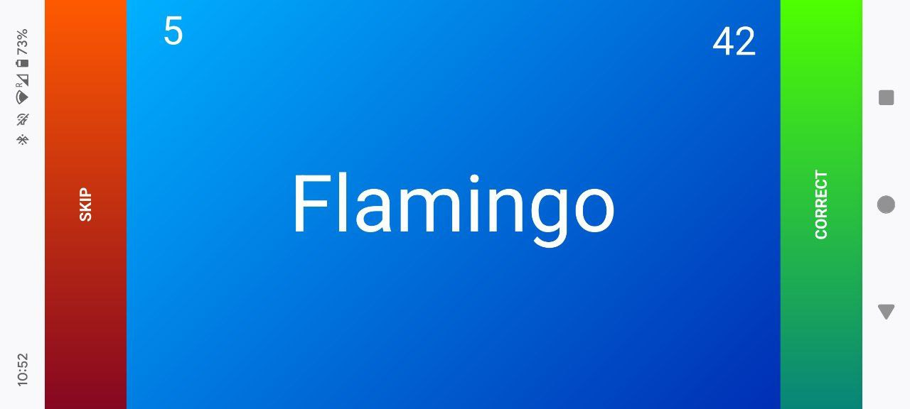
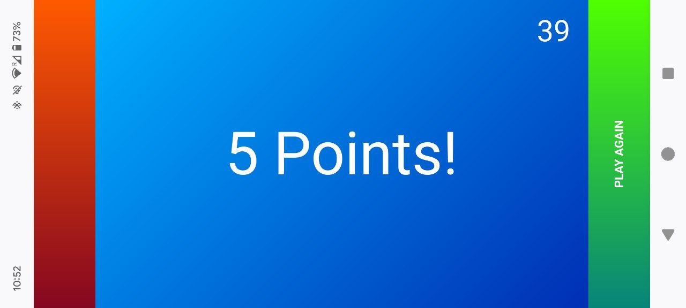

# Head's Up!
Mobile website for the popular "Head's Up!" game using barebone javascript for custom word decks and self-hosting.

---
✨ 🌈 I hate node.js - is barebone JS so hard? 🌈 ✨
---

### Screenshots

- press Start to begin the game
- use the red button to skip a name (or tilt your phone down)
- use the green button to count a point (or tilt your phone up)

- once the time runs out the final points are displayed

### URL Parameters

- https://kaon.ch/headsup?game=mando&time=90
- https://kaon.ch/headsup?game=default&time=60

The game can be customized using URL parameters like:

- `time=90` to set the game timer in seconds (default: 60)
- `game=mando` to pick the set of words (default: Mandalorian)

### Acknowledgements

@tlong314 [mobile-movement](https://github.com/tlong314/mobile-movement) JavaScript library accelerometer access and actions
